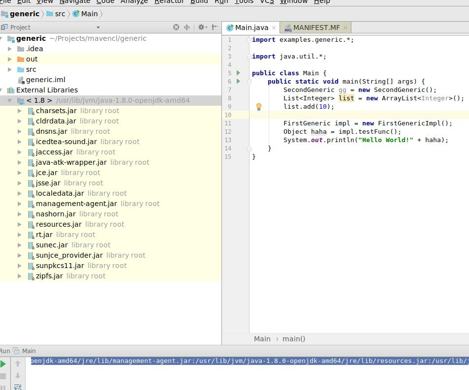

```bash
java --version
```
```
java 9.0.1
Java(TM) SE Runtime Environment (build 9.0.1+11)
Java HotSpot(TM) 64-Bit Server VM (build 9.0.1+11, mixed mode)
```

```bash
java --help
```

```

java --help
Usage: java [options] <mainclass> [args...]
           (to execute a class)
   or  java [options] -jar <jarfile> [args...]
           (to execute a jar file)
   or  java [options] -m <module>[/<mainclass>] [args...]
       java [options] --module <module>[/<mainclass>] [args...]
           (to execute the main class in a module)

 Arguments following the main class, -jar <jarfile>, -m or --module
 <module>/<mainclass> are passed as the arguments to main class.

 where options include:

    -d32	  Deprecated, will be removed in a future release
    -d64	  Deprecated, will be removed in a future release
    -cp <class search path of directories and zip/jar files>
    -classpath <class search path of directories and zip/jar files>
    --class-path <class search path of directories and zip/jar files>
                  A : separated list of directories, JAR archives,
                  and ZIP archives to search for class files.
    -p <module path>
    --module-path <module path>...
                  A : separated list of directories, each directory
                  is a directory of modules.
    --upgrade-module-path <module path>...
                  A : separated list of directories, each directory
                  is a directory of modules that replace upgradeable
                  modules in the runtime image
    --add-modules <module name>[,<module name>...]
                  root modules to resolve in addition to the initial module.
                  <module name> can also be ALL-DEFAULT, ALL-SYSTEM,
                  ALL-MODULE-PATH.
    --list-modules
                  list observable modules and exit
    -d <module name>
    --describe-module <module name>
                  describe a module and exit
    --dry-run     create VM and load main class but do not execute main method.
                  The --dry-run option may be useful for validating the
                  command-line options such as the module system configuration.
    --validate-modules
                  validate all modules and exit
                  The --validate-modules option may be useful for finding
                  conflicts and other errors with modules on the module path.
    -D<name>=<value>
                  set a system property
    -verbose:[class|module|gc|jni]
                  enable verbose output
    -version      print product version to the error stream and exit
    --version     print product version to the output stream and exit
    -showversion  print product version to the error stream and continue
    --show-version
                  print product version to the output stream and continue
    --show-module-resolution
                  show module resolution output during startup
    -? -h -help
                  print this help message to the error stream
    --help        print this help message to the output stream
    -X            print help on extra options to the error stream
    --help-extra  print help on extra options to the output stream
    -ea[:<packagename>...|:<classname>]
    -enableassertions[:<packagename>...|:<classname>]
                  enable assertions with specified granularity
    -da[:<packagename>...|:<classname>]
    -disableassertions[:<packagename>...|:<classname>]
                  disable assertions with specified granularity
    -esa | -enablesystemassertions
                  enable system assertions
    -dsa | -disablesystemassertions
                  disable system assertions
    -agentlib:<libname>[=<options>]
                  load native agent library <libname>, e.g. -agentlib:jdwp
                  see also -agentlib:jdwp=help
    -agentpath:<pathname>[=<options>]
                  load native agent library by full pathname
    -javaagent:<jarpath>[=<options>]
                  load Java programming language agent, see java.lang.instrument
    -splash:<imagepath>
                  show splash screen with specified image
                  HiDPI scaled images are automatically supported and used
                  if available. The unscaled image filename, e.g. image.ext,
                  should always be passed as the argument to the -splash option.
                  The most appropriate scaled image provided will be picked up
                  automatically.
                  See the SplashScreen API documentation for more information
    @argument files
                  one or more argument files containing options
    -disable-@files
                  prevent further argument file expansion
To specify an argument for a long option, you can use --<name>=<value> or
--<name> <value>.

```


See IDEA Run



```
/usr/lib/jvm/java-1.8.0-openjdk-amd64/bin/java -javaagent:/home/phuongtrinh/soft/ideaIU-2017.3.2/idea-IU-173.4127.27/lib/idea_rt.jar=38943:/home/phuongtrinh/soft/ideaIU-2017.3.2/idea-IU-173.4127.27/bin -Dfile.encoding=UTF-8 -classpath /usr/lib/jvm/java-1.8.0-openjdk-amd64/jre/lib/charsets.jar:/usr/lib/jvm/java-1.8.0-openjdk-amd64/jre/lib/ext/cldrdata.jar:/usr/lib/jvm/java-1.8.0-openjdk-amd64/jre/lib/ext/dnsns.jar:/usr/lib/jvm/java-1.8.0-openjdk-amd64/jre/lib/ext/icedtea-sound.jar:/usr/lib/jvm/java-1.8.0-openjdk-amd64/jre/lib/ext/jaccess.jar:/usr/lib/jvm/java-1.8.0-openjdk-amd64/jre/lib/ext/java-atk-wrapper.jar:/usr/lib/jvm/java-1.8.0-openjdk-amd64/jre/lib/ext/localedata.jar:/usr/lib/jvm/java-1.8.0-openjdk-amd64/jre/lib/ext/nashorn.jar:/usr/lib/jvm/java-1.8.0-openjdk-amd64/jre/lib/ext/sunec.jar:/usr/lib/jvm/java-1.8.0-openjdk-amd64/jre/lib/ext/sunjce_provider.jar:/usr/lib/jvm/java-1.8.0-openjdk-amd64/jre/lib/ext/sunpkcs11.jar:/usr/lib/jvm/java-1.8.0-openjdk-amd64/jre/lib/ext/zipfs.jar:/usr/lib/jvm/java-1.8.0-openjdk-amd64/jre/lib/jce.jar:/usr/lib/jvm/java-1.8.0-openjdk-amd64/jre/lib/jsse.jar:/usr/lib/jvm/java-1.8.0-openjdk-amd64/jre/lib/management-agent.jar:/usr/lib/jvm/java-1.8.0-openjdk-amd64/jre/lib/resources.jar:/usr/lib/jvm/java-1.8.0-openjdk-amd64/jre/lib/rt.jar:/home/phuongtrinh/Projects/mavencl/generic/out/production/generic Main
```

Formatted

```
/usr/lib/jvm/java-1.8.0-openjdk-amd64/bin/java

 -javaagent:/home/phuongtrinh/soft/ideaIU-2017.3.2/idea-IU-173.4127.27/lib/idea_rt.jar=44847
 :/home/phuongtrinh/soft/ideaIU-2017.3.2/idea-IU-173.4127.27/bin -Dfile.encoding=UTF-8
 
  -classpath /usr/lib/jvm/java-1.8.0-openjdk-amd64/jre/lib/charsets.jar
  :/usr/lib/jvm/java-1.8.0-openjdk-amd64/jre/lib/ext/cldrdata.jar
  :/usr/lib/jvm/java-1.8.0-openjdk-amd64/jre/lib/ext/dnsns.jar
  :/usr/lib/jvm/java-1.8.0-openjdk-amd64/jre/lib/ext/icedtea-sound.jar
  :/usr/lib/jvm/java-1.8.0-openjdk-amd64/jre/lib/ext/jaccess.jar
  :/usr/lib/jvm/java-1.8.0-openjdk-amd64/jre/lib/ext/java-atk-wrapper.jar
  :/usr/lib/jvm/java-1.8.0-openjdk-amd64/jre/lib/ext/localedata.jar
  :/usr/lib/jvm/java-1.8.0-openjdk-amd64/jre/lib/ext/nashorn.jar
  :/usr/lib/jvm/java-1.8.0-openjdk-amd64/jre/lib/ext/sunec.jar
  :/usr/lib/jvm/java-1.8.0-openjdk-amd64/jre/lib/ext/sunjce_provider.jar
  :/usr/lib/jvm/java-1.8.0-openjdk-amd64/jre/lib/ext/sunpkcs11.jar
  :/usr/lib/jvm/java-1.8.0-openjdk-amd64/jre/lib/ext/zipfs.jar
  :/usr/lib/jvm/java-1.8.0-openjdk-amd64/jre/lib/jce.jar
  :/usr/lib/jvm/java-1.8.0-openjdk-amd64/jre/lib/jsse.jar
  :/usr/lib/jvm/java-1.8.0-openjdk-amd64/jre/lib/management-agent.jar
  :/usr/lib/jvm/java-1.8.0-openjdk-amd64/jre/lib/resources.jar
  :/usr/lib/jvm/java-1.8.0-openjdk-amd64/jre/lib/rt.jar
  :/home/phuongtrinh/Projects/mavencl/generic/out/production/generic

  Main
```